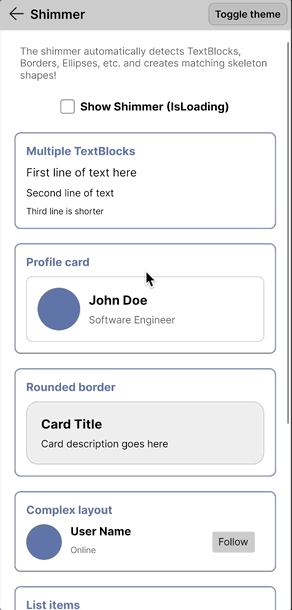

# Welcome to Nova.Avalonia.UI

**Nova.Avalonia.UI** is a comprehensive suite of UI controls for [Avalonia UI](https://avaloniaui.net/), designed to help developers build modern, accessible, and high-performance cross-platform applications.

## Documentation

The docs cover everything from first steps to detailed control APIs and samples, aiming to make the library easy to adopt and extend. If you’re interested in exploring more, you can find it here: https://jsuarezruiz.github.io/Nova.Avalonia.UI/

## Controls

### Avatar

The `Avatar` control presents a person's identity using an image, initials, icon, or custom content. It includes automatic background generation, size presets, and optional presence status indicators.

### Shimmer

The `Shimmer` control shows a lightweight skeleton while your content is loading. It inspects the visual tree beneath it to draw shapes that match controls, then animates a gradient sweep over the placeholders.

## Contribute

Do you want to contribute?.

**Found a Bug?**

If you find a bug, you can help me by submitting an [issue](https://github.com/jsuarezruiz/Nova.Avalonia.UI/issues). Even better, you can submit a [Pull Request](https://github.com/jsuarezruiz/Nova.Avalonia.UI/pulls) with a fix.

**Submitting a pull request**

For every contribution, you must:
- Test your code.
- target main branch (or an appropriate release branch if appropriate for a bug fix).

## Feedback or Requests

Use GitHub [Issues](https://github.com/jsuarezruiz/Nova.Avalonia.UI/issues) for bug reports and feature requests.

## Copyright and license

Code released under the [MIT license](https://opensource.org/licenses/MIT).